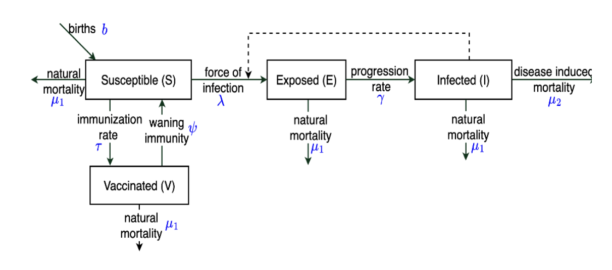

# MMED2025-Rabies-Group-Project

Topic: Accelerating Rabies Elimination

Group members: Rachel, Zizipo, Faith, Patience, Alice, Omar

Faculty: Mutono and Martha

Google Drive: https://drive.google.com/drive/folders/1YcdzgUhQ0qEjm6hbez-hP0zxuePdycW7?usp=sharing

RESEARCH QUESTION

1. What level of vaccination coverage is required to eliminate rabies transmission in the domestic dog population in Tanzania by 2030? 2. How does the effectiveness of continuous dog rabies vaccination compare to periodic mass vaccination campaigns in reducing rabies incidence in Tanzania?

P- Domestic dog population in Tanzania

I- Rabies vaccination through continuous or periodic campaigns

C- Current vaccination coverage (5%)

O- Elimination (reduction to zero) of rabies incidence by 2030

PROGRESS

Day 9 - Tuesday 24 June

By the end of Day 9, we will have finalised a research question, chosen our parameter values, and debugged our deterministic model.

Then, we will include variations in vaccination delivery timing.
Day 10 - Wednesday 25 June 
Our main focus today is to develop a finalised model with which we shall simulate variations in vaccinations. First, the stochastic model needs to be debugged and finalised. While the coding team from yesterday is doing this (Omar, Zizipo, Patience), the literature team from yesterday (Rachel, Alice, Faith) is working on the report and presentations.

We shall split into teams to address the following components:

Incorporating contact rate - Rachel and Faith
Incorporating spillover - Omar and Zizipo
Modelling periodic vaccination - Alice and Patience

We decided to focus on getting a simple version of the model working and opted to increase complexity later if time allows. Working in parallel, we created a function to vary parameters for sensitivity analysis and run multiple functions, as well as creating a version of the code to simulate vaccination campaigns.
Day 11 - Thursday 26 June 
Today we want to obtain final simulation results by incorporating our sensitivity analysis with campaign vaccinations.

